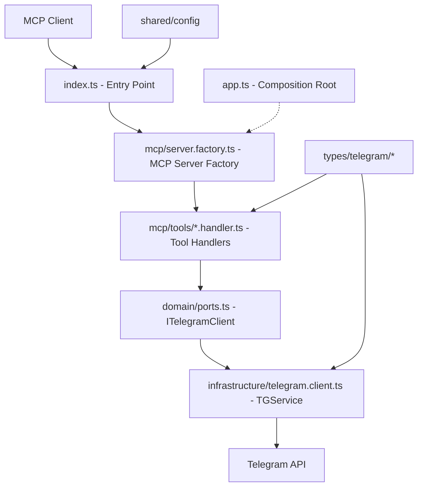

# Architecture Documentation

This document describes the architecture of the `telegram-mcp-server` project organized by business domain following Domain-Driven Design (DDD) and Hexagonal Architecture principles.

## Overview

The application is structured into business domains with clear separation of concerns:

```
src/
├── application/             # Application layer - Use cases and orchestration
│   └── ProcessUpdateUseCase.ts
├── domain/                  # Domain layer - Business logic and contracts
│   └── ports.ts            # Domain interfaces (ITelegramClient)
├── infrastructure/          # Infrastructure layer - External adapters
│   └── telegram.client.ts  # Telegram API client implementation
├── mcp/                     # MCP (Model Context Protocol) layer
│   ├── server.factory.ts   # MCP server factory and configuration
│   └── tools/              # MCP tools - One tool per file
│       ├── getBotInfo.handler.ts      # Get bot information tool
│       ├── sendMessage.handler.ts     # Send message tool
│       ├── getUpdates.handler.ts      # Get updates tool
│       ├── forwardMessage.handler.ts  # Forward message tool
│       └── handlers.ts               # Tool handlers barrel export
├── types/                   # Shared type definitions
│   └── telegram/           # Telegram-specific types
│       ├── index.ts        # Type exports
│       ├── boost.types.ts
│       ├── business.types.ts
│       ├── chat.types.ts
│       ├── common.types.ts
│       ├── core.types.ts
│       ├── inline.types.ts
│       ├── message.types.ts
│       ├── payment.types.ts
│       ├── poll.types.ts
│       ├── reaction.types.ts
│       └── update.types.ts
├── shared/                  # Shared utilities
│   └── config/             # Configuration management
│       └── index.ts
├── tests/                   # Test suite
│   ├── service.test.ts
│   ├── service.integration.test.ts
│   └── __mocks__/
│       └── telegramApi.ts
├── app.ts                  # Composition root (DI container)
└── index.ts               # Entry point (MCP server)
```

## Architecture Principles

### 1. Hexagonal Architecture (Ports & Adapters)
The application follows the hexagonal architecture pattern:

- **Domain Core**: Contains business logic and defines contracts (ports)
- **Application Layer**: Orchestrates use cases and coordinates between domain and infrastructure
- **Infrastructure Layer**: Implements external adapters (Telegram API client)
- **Adapters**: Handle external communication (MCP server, HTTP client)

### 2. Dependency Inversion Principle
- Inner layers (domain) define interfaces (ports)
- Outer layers (infrastructure) implement these interfaces
- Dependencies are injected from the composition root (`app.ts`)

### 3. Clean Architecture Layers


## Detailed Architecture

### Entry Point Layer (`index.ts`)
**Responsibility**: MCP (Model Context Protocol) server interface

- **Clean Entry Point**: Minimal bootstrap logic, delegates to factory
- **Configuration Loading**: Environment setup and validation
- **Server Initialization**: Uses MCPServerFactory for clean separation
- **Error Handling**: Centralized error management and graceful shutdown

### MCP Layer (`mcp/`)
**Responsibility**: Model Context Protocol implementation and tool management

#### Server Factory (`server.factory.ts`)
- **Server Configuration**: Creates and configures MCP server instance
- **Tool Registration**: Registers all Telegram tools with proper schemas
- **Capability Declaration**: Defines available tools and their parameters
- **Clean Architecture**: Separates MCP concerns from business logic

#### Tool Handlers (`tools/*.handler.ts`)
**Modular Tool Architecture**: One file per tool for maintainability
- **`getBotInfo.handler.ts`**: Bot information retrieval tool
- **`sendMessage.handler.ts`**: Message sending functionality
- **`getUpdates.handler.ts`**: Update polling tool
- **`forwardMessage.handler.ts`**: Message forwarding tool

Each tool handler includes:
- Parameter validation schemas
- Error handling and formatting
- Type-safe execution methods
- Capability definitions

### Composition Root (`app.ts`)
**Responsibility**: Dependency injection and application bootstrap

- **Dependency Wiring**: Instantiates and connects all application components
- **Configuration Management**: Loads and validates environment configuration
- **Application Lifecycle**: Handles startup, shutdown, and error management
- **Polling Logic**: Implements update polling mechanism for bot operation

Key features:
- Constructor injection pattern
- Centralized error handling
- Bot authentication verification
- Long-polling implementation

### Application Layer (`application/ProcessUpdateUseCase.ts`)
**Responsibility**: Use case orchestration and business flow coordination

- **Bot Information Management**: `getBotInfo()` - Retrieves and validates bot information
- **Update Processing**: `fetchUpdates()` - Manages update polling from Telegram
- **Business Logic**: `processUpdate()` - Implements core bot behavior (echo functionality)
- **Batch Processing**: `processUpdates()` - Handles multiple updates with error isolation

Design patterns:
- Use Case pattern for business operations
- Command pattern for update processing
- Error handling with graceful degradation

### Domain Layer (`domain/ports.ts`)
**Responsibility**: Business contracts and domain interfaces

Defines `ITelegramClient` interface with core operations:
- `getMe()`: Bot authentication and information retrieval
- `sendMessage()`: Message sending capabilities
- `getUpdates()`: Update polling contract
- `forwardMessage()`: Message forwarding functionality

Domain characteristics:
- Pure interfaces without implementation details
- Technology-agnostic contracts
- Focused on business capabilities
- Enables dependency inversion

### Infrastructure Layer (`infrastructure/telegram.client.ts`)
**Responsibility**: External API integration and technical implementation

`TGService` class implements `ITelegramClient`:
- **HTTP Client Management**: Axios-based HTTP communication
- **Authentication**: Bot token management and API security
- **Error Handling**: Telegram API error processing and retry logic
- **Request/Response Transformation**: Data mapping between domain and API formats

Technical features:
- Configurable HTTP client with interceptors
- Comprehensive error handling and logging
- Type-safe request/response handling
- API rate limiting consideration

### Type System (`types/telegram/`)
**Responsibility**: Comprehensive type definitions for Telegram API

Modular type organization:
- **Core Types** (`core.types.ts`): Fundamental Telegram entities
- **Message Types** (`message.types.ts`): Message-related structures
- **Chat Types** (`chat.types.ts`): Chat and member definitions
- **Update Types** (`update.types.ts`): Bot update structures
- **Business Types** (`business.types.ts`): Telegram Business API types
- **Payment Types** (`payment.types.ts`): Payment and commerce types
- **Poll Types** (`poll.types.ts`): Polling functionality types
- **Reaction Types** (`reaction.types.ts`): Message reaction types
- **Inline Types** (`inline.types.ts`): Inline bot functionality
- **Common Types** (`common.types.ts`): Shared utility types
- **Boost Types** (`boost.types.ts`): Chat boost functionality

Benefits:
- Complete Telegram API coverage
- Strong typing throughout the application
- Modular organization for maintainability
- Centralized type exports via barrel pattern

### Shared Layer (`shared/config/`)
**Responsibility**: Cross-cutting concerns and utilities

Configuration management:
- Environment variable loading and validation
- Type-safe configuration interfaces
- Centralized configuration access
- Runtime environment detection

## Data Flow

### 1. MCP Request Flow
```
MCP Client Request → index.ts → TGService → Telegram API → Response
```

### 2. Polling Flow
```
app.ts → ProcessUpdateUseCase → ITelegramClient → TGService → Telegram API
```

### 3. Update Processing Flow
```
Telegram Update → ProcessUpdateUseCase.processUpdate() → Business Logic → Response
```

## Key Design Patterns

### 1. **Ports and Adapters Pattern**
- `ITelegramClient` (Port) defines the contract
- `TGService` (Adapter) implements the contract
- Enables easy testing and technology switching

### 2. **Factory Pattern**
- `MCPServerFactory` encapsulates server creation and configuration
- Centralizes tool registration and capability management
- Simplifies testing and reduces coupling

### 3. **Handler Pattern**
- Each MCP tool has its own handler class
- Consistent interface for parameter validation and execution
- Easy to add, remove, or modify individual tools

### 4. **Use Case Pattern**
- `ProcessUpdateUseCase` encapsulates business operations
- Single responsibility per use case
- Clear separation of concerns

### 5. **Composition Root Pattern**
- `app.ts` handles all dependency instantiation
- Centralized dependency management
- Simplified testing through constructor injection

## Testing Strategy

### Unit Tests (`src/tests/service.test.ts`)
- Mock-based testing using Jest
- Tests business logic in isolation
- Fast execution without external dependencies
- Focus on domain and application layer testing

### Integration Tests (`src/tests/service.integration.test.ts`)
- Real API testing against Telegram
- End-to-end functionality verification
- Network and authentication testing
- Environment-specific test configuration

### Mock Strategy (`src/tests/__mocks__/telegramApi.ts`)
- Comprehensive API mocking
- Predictable test data
- Error scenario simulation
- Isolation of external dependencies

## Configuration Management

### Environment Variables
- `TELEGRAM_TOKEN`: Bot authentication token (required)
- `NODE_ENV`: Runtime environment (development/production)

### Configuration Validation
- Required variable validation at startup
- Type-safe configuration interfaces
- Clear error messages for missing configuration

## Error Handling Strategy

### Domain Level
- Interface-based error contracts
- Business rule validation
- Domain-specific exceptions

### Infrastructure Level
- HTTP error handling and retry logic
- Telegram API error interpretation
- Network failure resilience

### Application Level
- Use case error aggregation
- Graceful degradation strategies
- Comprehensive error logging

## Security Considerations

### Authentication
- Secure token management
- Environment-based configuration
- Token validation at startup

### API Security
- HTTPS communication enforcement
- Request/response validation
- Rate limiting awareness

## Performance Characteristics

### Scalability
- Stateless application design
- Efficient polling mechanism
- Memory-conscious update processing

### Monitoring
- Comprehensive error logging
- Performance metric collection capability
- Health check endpoints ready

## Technology Stack

### Core Dependencies
- **TypeScript**: Static typing and modern JavaScript features
- **Axios**: HTTP client for reliable API communication
- **@modelcontextprotocol/sdk**: MCP server implementation
- **dotenv**: Environment configuration management

### Development Tools
- **Jest**: Testing framework with mocking capabilities
- **tsx**: TypeScript execution for development
- **ESLint/Prettier**: Code quality and formatting (configurable)

### Build & Deployment
- **TypeScript Compiler**: Production build generation
- **Node.js**: Runtime environment
- **npm**: Package management and script execution

## Future Extension Guidelines

### Adding New MCP Tools
1. Create new tool handler in `src/mcp/tools/newTool.handler.ts`
2. Implement handler with parameter schema and execute method
3. Add tool export to `src/mcp/tools/handlers.ts`
4. Update `MCPServerFactory` to register the new tool
5. Add tool capability to server configuration

### Extending Telegram Functionality
1. Add new methods to `ITelegramClient` interface
2. Implement in `TGService` class
3. Add corresponding types in `types/telegram/`
4. Create new tool handler for MCP exposure
5. Update use cases to utilize new functionality

### Adding Persistence
1. Define repository interfaces in `domain/ports.ts`
2. Implement database adapters in `infrastructure/`
3. Update composition root for dependency injection
4. Add configuration for database connections

### Adding New External Services
1. Define service interfaces in `domain/ports.ts`
2. Implement adapters in `infrastructure/`
3. Add configuration management
4. Update use cases and composition root

## Tool Development Best Practices

### Creating New Tools
- Follow the handler pattern established by existing tools
- Include comprehensive parameter validation
- Provide clear error messages and handling
- Add JSDoc documentation for all public methods
- Use consistent naming conventions (e.g., `*.handler.ts`)

### Tool Structure
```typescript
export class NewToolHandler {
  static readonly NAME = "tool_name";
  static readonly DESCRIPTION = "Tool description";
  static readonly PARAMETERS = z.object({...});
  
  constructor(private readonly telegramClient: ITelegramClient) {}
  
  async execute(args: ToolArgs) { /* implementation */ }
  static getCapability() { /* capability definition */ }
  static getParameterShape() { /* parameter schema */ }
}
```

## Best Practices

### Code Organization
- Follow single responsibility principle
- Maintain clear layer boundaries
- Use dependency injection throughout
- Keep interfaces focused and cohesive

### Testing
- Write tests for all business logic
- Mock external dependencies
- Maintain high test coverage
- Use both unit and integration tests

### Error Handling
- Handle errors at appropriate levels
- Provide meaningful error messages
- Log errors comprehensively
- Implement graceful degradation

### Configuration
- Validate configuration at startup
- Use environment variables for external configuration
- Provide clear documentation for required settings
- Implement configuration type safety

This architecture ensures maintainable, testable, and scalable code that can evolve with changing requirements while maintaining clean separation of concerns.