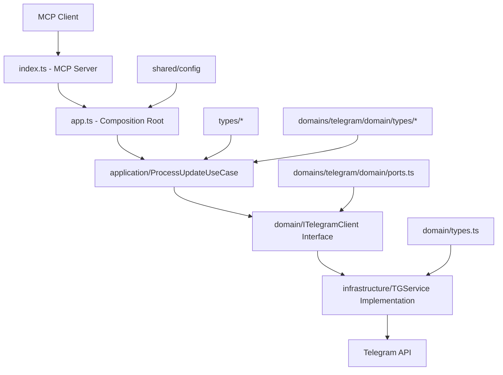

# Architecture Documentation

This document describes the architecture of the `telegram-mcp-server` project organized by business domain following Domain-Driven Design (DDD) and Hexagonal Architecture principles.

## Overview

The application is structured into business domains with clear separation of concerns:

```
src/
├── domains/                  # Business domains
│   └── telegram/            # Telegram domain
│       ├── domain/          # Pure business logic
│       │   ├── ports.ts     # Domain interfaces
│       │   └── types/       # Telegram-specific types
│       └── infrastructure/  # External adapters
├── application/             # Shared use cases / orchestration
│   └── ProcessUpdateUseCase.ts
├── domain/                  # Global domain layer
│   ├── ports.ts            # Global interfaces
│   └── types.ts            # Core domain types
├── infrastructure/          # Global infrastructure
│   └── telegram.client.ts  # Telegram API client
├── types/                   # Shared type definitions
│   ├── telegram/           # Telegram-specific types
│   └── *.types.ts          # Various entity types
├── tests/                   # Tests
│   ├── service.test.ts
│   ├── service.integration.test.ts
│   └── __mocks__/
├── shared/                  # Shared code
│   └── config/             # Global configuration
├── app.ts                  # Composition root (DI)
└── index.ts               # Entry point (bootstrap)
```

## Architecture principles

### 1. Domain-Driven Design (DDD)
- **Domains**: Each business feature is isolated in its own domain
- **Ubiquitous Language**: Business vocabulary is respected in code
- **Bounded Context**: Each domain has its own types and rules

### 2. Hexagonal Architecture (Ports & Adapters)
- **Domain**: Pure business logic, independent of infrastructure
- **Ports**: Interfaces defining contracts
- **Adapters**: Concrete implementations of ports

### 3. Dependency inversion
- Inner layers never depend on outer layers
- Dependencies are injected via interfaces

## Detailed structure

### Architecture layers

#### `src/domain/` - Global domain layer
- **`types.ts`**: Core domain types and entities
  - `TelegramUser`, `TelegramUpdate`, `Message`, `Chat`, etc.
  - Complete Telegram API type definitions
  - Purely functional types, no external dependencies
  
- **`ports.ts`**: Global domain interfaces (contracts)
  - `ITelegramClient`: Contract for Telegram API access
  - Defines available business operations

#### `src/domains/telegram/` - Telegram-specific domain
- **`domain/ports.ts`**: Telegram-specific interfaces
  - Extends global domain interfaces
  - References types from global type system
- **`domain/types/`**: Telegram domain-specific types
  - Organized by functionality (boost, business, chat, etc.)
  - Modular type definitions for better maintainability
- **`infrastructure/`**: Telegram adapters
  - Implementation of Telegram API clients

#### `src/application/` - Shared application layer
- **`ProcessUpdateUseCase.ts`**: Business orchestrator
  - Coordinates interactions between domain and infrastructure
  - Implements application logic (echo bot, etc.)
  - Uses `ITelegramClient` via dependency injection

#### `src/infrastructure/` - Global infrastructure
- **`telegram.client.ts`**: `ITelegramClient` implementation
  - `TGService`: HTTP client for Telegram API
  - Error handling, retry, authentication
  - Uses axios for HTTP calls

#### `src/types/` - Shared type definitions
- Centralized type definitions organized by domain
- **`telegram/`**: Telegram-specific types
- **`*.types.ts`**: Various entity types (boost, business, chat, etc.)
- **`index.ts`**: Type exports and public API

#### `src/tests/` - Global tests
- **`service.test.ts`**: Unit tests with mocks
- **`service.integration.test.ts`**: Integration tests with real API
- **`__mocks__/`**: Test fixtures and mock utilities

### Shared code (`src/shared/`)

#### `config/` - Global configuration
- **`index.ts`**: Environment variables loading and validation
- Centralizes configuration management
- Validates required parameters

### Composition (`src/app.ts`)
- **Composition Root**: Dependency instantiation and wiring
- **Dependency Injection**: Adapter injection into use cases
- **Bootstrap**: Application initialization and startup

### Entry point (`src/index.ts`)
- MCP (Model Context Protocol) interface
- Telegram tools exposure via MCP API
- Bridge between internal architecture and external interface

## Data flow



## Architecture characteristics

### 1. **Hybrid Domain Structure**
- **Global layers**: Shared `domain/`, `application/`, `infrastructure/` for common functionality
- **Domain-specific layers**: `domains/*/` for business-specific logic
- **Centralized types**: `types/` for shared type definitions
- **Modular organization**: Types split by functionality for better maintainability

### 2. **Type System Organization**
- **Global types** (`src/types/`): Shared across the entire application
- **Domain types** (`src/domains/*/domain/types/`): Domain-specific entities
- **Modular types**: Split by functionality (boost, business, chat, message, etc.)
- **Index exports**: Centralized type exports for clean imports

## Benefits of this architecture
- Each layer can be tested independently
- Easy mocking via interfaces
- Fast unit tests without external dependencies

### 2. **Maintainability**
- Clear separation of responsibilities
- Business code isolated from infrastructure
- Facilitates modifications and evolution

### 3. **Flexibility**
- Easy API changes (replace `TGService`)
- Simple addition of new business domains
- Centralized and modifiable configuration

### 4. **Scalability**
- Structure ready for new domains
- Reusable patterns
- Horizontal scaling possible

## Patterns used

### 1. **Repository Pattern**
- `ITelegramClient` acts as a repository
- Abstraction of external data access

### 2. **Use Case Pattern**
- `ProcessUpdateUseCase` encapsulates application logic
- One use case per business action

### 3. **Dependency Injection**
- Dependency inversion via constructor
- Composition in `app.ts`

### 4. **Interface Segregation**
- Specific and cohesive interfaces
- No unnecessary dependencies

## Development rules

### 1. **Allowed dependencies**
```
domain/ ← DEPENDS ON NOTHING (pure types)
domains/*/domain/ ← domain/ + types/ only
application/ ← domain/ + domains/*/domain/ + types/
infrastructure/ ← domain/ + types/ + external libraries
domains/*/infrastructure/ ← domains/*/domain/ + types/ + external libraries
types/ ← DEPENDS ON NOTHING (pure types)
shared/ ← external libraries only
```

### 2. **Tests**
- Centralized tests in `src/tests/`
- Unit tests with mocks (`service.test.ts`)
- Integration tests with real API (`service.integration.test.ts`)
- Mock utilities in `__mocks__/` directory

### 3. **Types**
- Strict typing with TypeScript
- Explicit interfaces for all contracts
- No `any` in business code

### 4. **Configuration**
- Centralized environment variables in `shared/config/`
- Validation at startup
- No direct access to `process.env` in domains

### 5. **Type organization**
- Global types in `src/types/` for shared entities
- Domain-specific types in `src/domains/*/domain/types/`
- Modular type organization by functionality
- Centralized exports via index files

## Future extension

### Adding a new domain
1. Create `src/domains/new-domain/`
2. Follow the same structure (domain/application/infrastructure/tests)
3. Add to `app.ts` for composition
4. Expose via `index.ts` if needed

### Adding persistence
1. Create `src/shared/database/`
2. Add interfaces in `domain/ports.ts`
3. Implement in `infrastructure/`
4. Inject into `application/`

### Adding messaging
1. Create an `events/` domain
2. Publisher/Subscriber pattern
3. Infrastructure with Redis/RabbitMQ
4. Integration in use cases

## Technologies and patterns

- **TypeScript**: Static typing and safety
- **Axios**: HTTP client with interceptors
- **Jest**: Unit and integration testing
- **ESModules**: ES6 modules with .js extensions
- **MCP**: Model Context Protocol for interface
- **Dotenv**: Environment variables management

This architecture ensures maintainable, testable, and scalable code, ready for the project's future needs.
