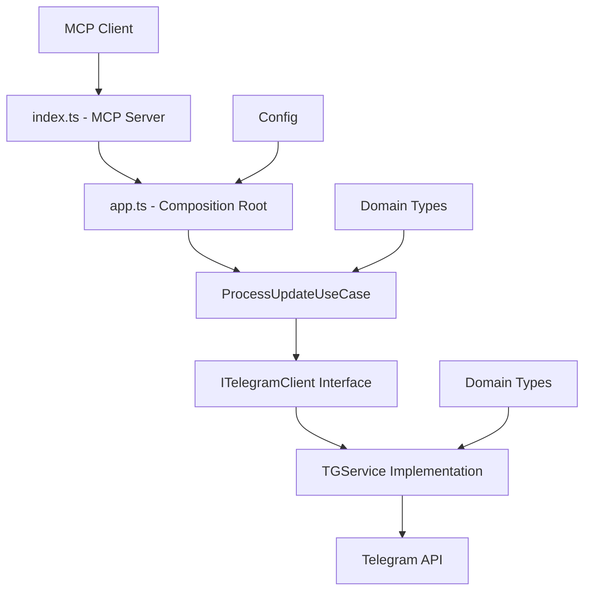

# Architecture Documentation

This document describes the architecture of the `telegram-mcp-server` project organized by business domain following Domain-Driven Design (DDD) and Hexagonal Architecture principles.

## Overview

The application is structured into business domains with clear separation of concerns:

```
src/
├── domains/                  # Business domains
│   └── telegram/            # Telegram domain
│       ├── application/     # Use cases / orchestration
│       ├── domain/          # Pure business logic
│       ├── infrastructure/  # External adapters
│       └── tests/          # Domain tests
├── shared/                  # Shared code
│   └── config/             # Global configuration
├── app.ts                  # Composition root (DI)
└── index.ts               # Entry point (bootstrap)
```

## Architecture principles

### 1. Domain-Driven Design (DDD)
- **Domains**: Each business feature is isolated in its own domain
- **Ubiquitous Language**: Business vocabulary is respected in code
- **Bounded Context**: Each domain has its own types and rules

### 2. Hexagonal Architecture (Ports & Adapters)
- **Domain**: Pure business logic, independent of infrastructure
- **Ports**: Interfaces defining contracts
- **Adapters**: Concrete implementations of ports

### 3. Dependency inversion
- Inner layers never depend on outer layers
- Dependencies are injected via interfaces

## Detailed structure

### Telegram Domain (`src/domains/telegram/`)

#### `domain/` - Pure business logic
- **`types.ts`**: Telegram domain types and entities
  - `TelegramUser`, `TelegramUpdate`, `Message`, `Chat`, etc.
  - Purely functional types, no external dependencies
  
- **`ports.ts`**: Domain interfaces (contracts)
  - `ITelegramClient`: Contract for Telegram API access
  - Defines available business operations

#### `infrastructure/` - External adapters
- **`telegram.client.ts`**: `ITelegramClient` implementation
  - `TGService`: HTTP client for Telegram API
  - Error handling, retry, authentication
  - Uses axios for HTTP calls

#### `application/` - Use cases
- **`ProcessUpdateUseCase.ts`**: Business orchestrator
  - Coordinates interactions between domain and infrastructure
  - Implements application logic (echo bot, etc.)
  - Uses `ITelegramClient` via dependency injection

#### `tests/` - Domain tests
- Unit tests with mocks
- Integration tests with real API
- Fixtures and test utilities

#### `index.ts` - Domain public API
- Exports only public elements
- Controlled entry point for other modules

### Shared code (`src/shared/`)

#### `config/` - Global configuration
- **`index.ts`**: Environment variables loading and validation
- Centralizes configuration management
- Validates required parameters

### Composition (`src/app.ts`)
- **Composition Root**: Dependency instantiation and wiring
- **Dependency Injection**: Adapter injection into use cases
- **Bootstrap**: Application initialization and startup

### Entry point (`src/index.ts`)
- MCP (Model Context Protocol) interface
- Telegram tools exposure via MCP API
- Bridge between internal architecture and external interface

## Data flow



## Benefits of this architecture

### 1. **Testability**
- Each layer can be tested independently
- Easy mocking via interfaces
- Fast unit tests without external dependencies

### 2. **Maintainability**
- Clear separation of responsibilities
- Business code isolated from infrastructure
- Facilitates modifications and evolution

### 3. **Flexibility**
- Easy API changes (replace `TGService`)
- Simple addition of new business domains
- Centralized and modifiable configuration

### 4. **Scalability**
- Structure ready for new domains
- Reusable patterns
- Horizontal scaling possible

## Patterns used

### 1. **Repository Pattern**
- `ITelegramClient` acts as a repository
- Abstraction of external data access

### 2. **Use Case Pattern**
- `ProcessUpdateUseCase` encapsulates application logic
- One use case per business action

### 3. **Dependency Injection**
- Dependency inversion via constructor
- Composition in `app.ts`

### 4. **Interface Segregation**
- Specific and cohesive interfaces
- No unnecessary dependencies

## Development rules

### 1. **Allowed dependencies**
```
domain/ ← DEPENDS ON NOTHING (pure types)
application/ ← domain/ only
infrastructure/ ← domain/ + external libraries
shared/ ← external libraries only
```

### 2. **Tests**
- One test per layer
- Mocks for external dependencies
- Integration tests separated from unit tests

### 3. **Types**
- Strict typing with TypeScript
- Explicit interfaces for all contracts
- No `any` in business code

### 4. **Configuration**
- Centralized environment variables
- Validation at startup
- No direct access to `process.env` in domains

## Future extension

### Adding a new domain
1. Create `src/domains/new-domain/`
2. Follow the same structure (domain/application/infrastructure/tests)
3. Add to `app.ts` for composition
4. Expose via `index.ts` if needed

### Adding persistence
1. Create `src/shared/database/`
2. Add interfaces in `domain/ports.ts`
3. Implement in `infrastructure/`
4. Inject into `application/`

### Adding messaging
1. Create an `events/` domain
2. Publisher/Subscriber pattern
3. Infrastructure with Redis/RabbitMQ
4. Integration in use cases

## Technologies and patterns

- **TypeScript**: Static typing and safety
- **Axios**: HTTP client with interceptors
- **Jest**: Unit and integration testing
- **ESModules**: ES6 modules with .js extensions
- **MCP**: Model Context Protocol for interface
- **Dotenv**: Environment variables management

This architecture ensures maintainable, testable, and scalable code, ready for the project's future needs.
